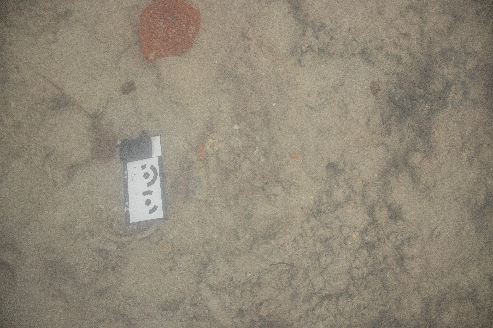
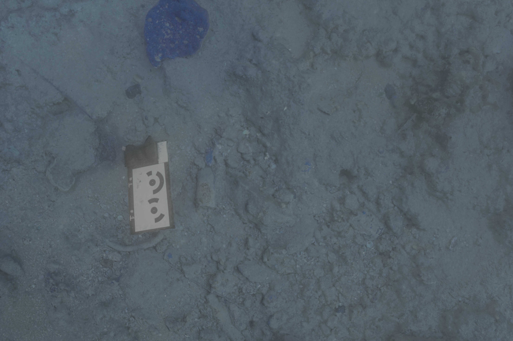
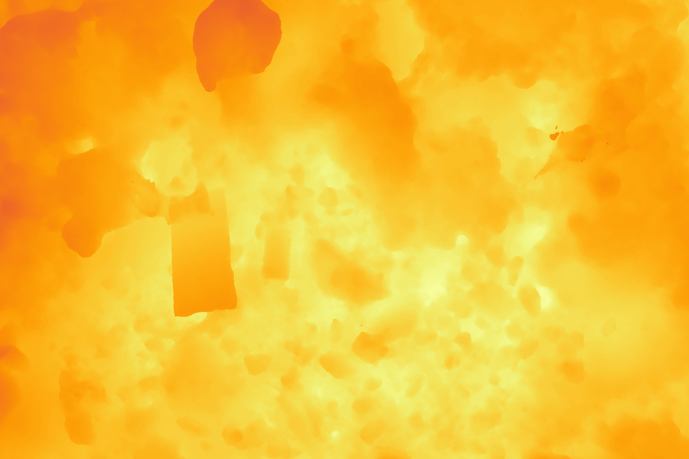
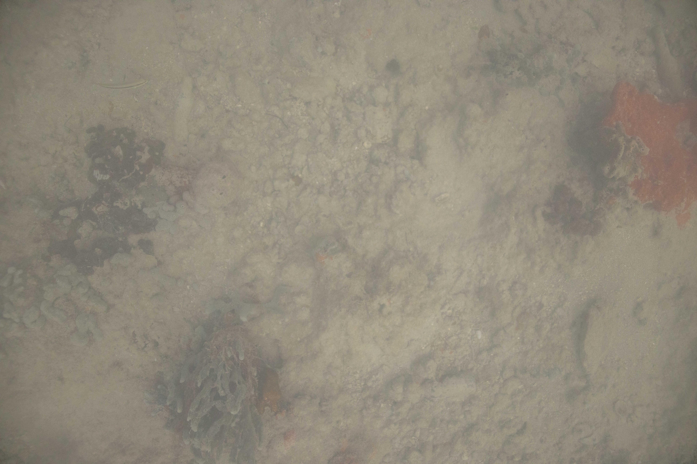
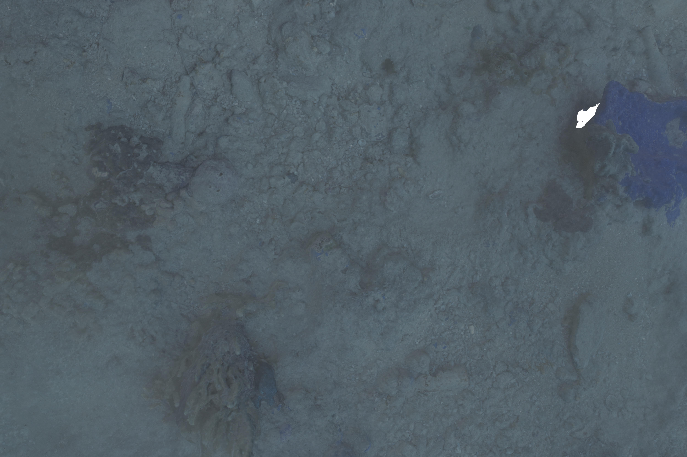
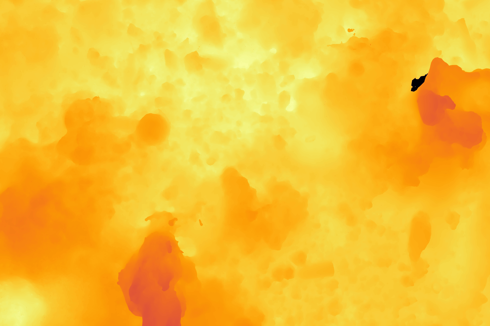
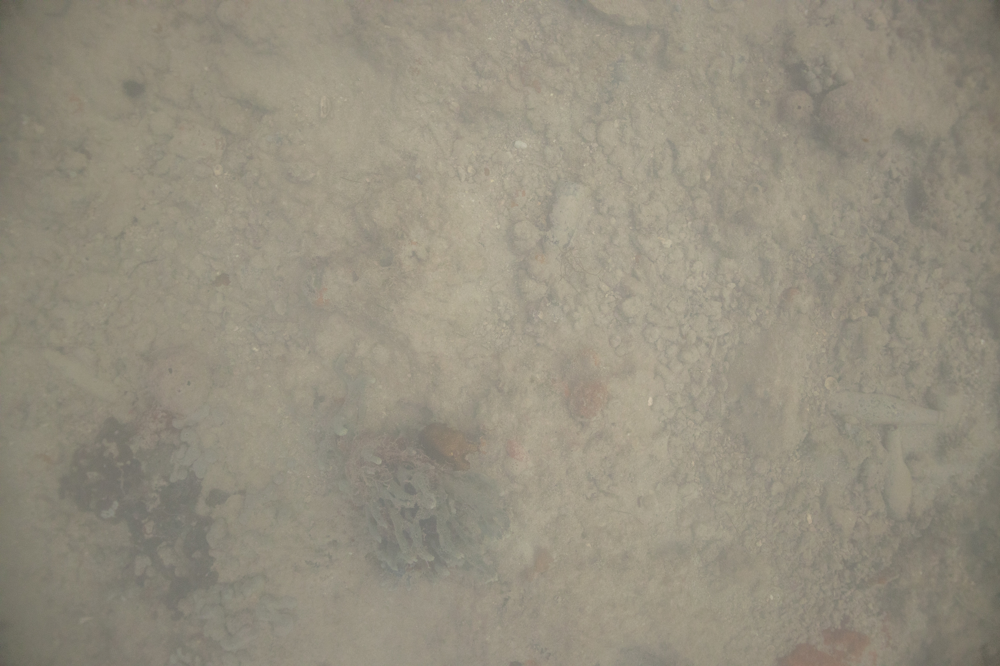
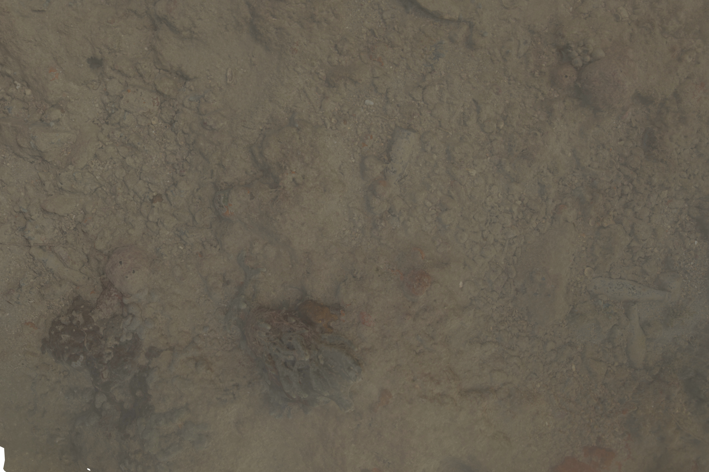
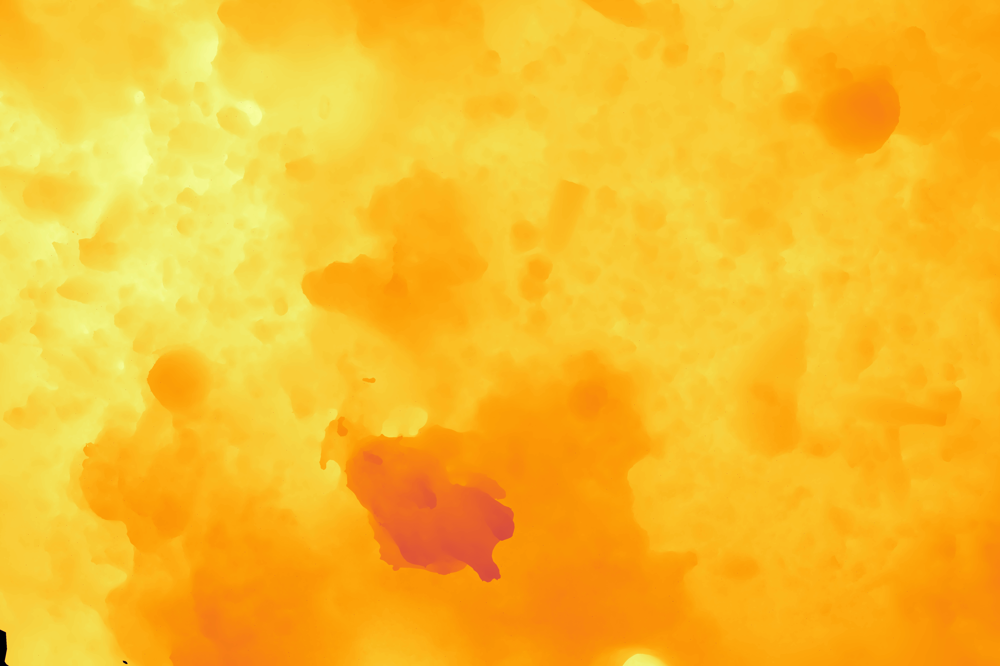

# MeshToDepth: Generate Depth Maps from 3D Meshes and Camera Poses

MeshToDepth is a Python tool designed to generate depth maps from a 3D mesh (`.obj`, `.ply`, `.stl`, `.gltf`, `.glb`) using camera pose information. It simulates camera views based on provided calibration and transformation data, performs ray tracing against the mesh, and outputs depth images corresponding to each camera view.

## Key Features

* **Depth and Heat Map Generation:** Generates 16-bit depth maps (in millimeters) from specified camera viewpoints. A value of zero indicates an invalid depth measurement. It also automatically produces corresponding heat maps for easy visualization of the depth data.

* **Support for Multiple Camera Formats:** Integrates seamlessly with popular photogrammetry software. It currently supports camera calibration and pose files from **Agisoft Metashape (.xml)** and **Meshroom (.sfm)**. Support for other software solutions can be added by extending the parsers available.

* **Mesh Scaling and Distortion:** Provides robust options for accurate, real-world measurements. You can dynamically rescale depth data by specifying a known distance between camera poses and apply camera distortion models to the generated depth maps and images.

* **Perspective Correction:** Optionally aligns the output depth maps and rendered views to match a real-world reference photograph. Using feature matching (SIFT) and image homography, it corrects the perspective and can even generate complete, null-region-free views by adjusting the field of view.

* **Manual View Generation:** For custom setups, you can define your own camera views for depth computation. While you provide the camera intrinsics for these views, a camera file is still needed if you plan to enable mesh rescaling.

* **Optional Scene Rendering:** You can choose to save rendered RGB images of the mesh from each camera view. Useful for debugging and visualizing the scene, though it will increase both computation time and resource usage.

**Note:** The quality of the output depth maps and rendered scenes is directly dependent on the quality of the input mesh.

**Another Note:** This toolkit picks up from the last pose processed in-case its workflow was interrupted. If you would like to recompute everything, please empty the output folder first before running.

## Recommended Mesh File Formats

The choice of mesh file format significantly impacts the performance of depth map processing, affecting both **loading speed** and **computational resource** consumption. For optimal performance, we strongly recommend using a **binary file format** over an ASCII-based one.

### Why Binary Formats Are Better

Binary formats like **`.stl`**, **`.ply`**, and **`.glb`** are recommended since they are:
* **More compact** in size.
* **Loaded faster** due to their lower-level representation.
* **Less resource-intensive**, consuming significantly less memory during parsing.

In contrast, ASCII-based formats like **`.obj`** and **`.gltf`** can consume up to **5x more memory** just for parsing.

### Choosing the Right Format for Your Needs

* **For untextured meshes**: We recommend using the **`.stl`** format. It's a simple, robust, and widely supported standard perfect for meshes without color information.
* **For meshes with color/texture**: We recommend the **`.ply`** format. It offers excellent support for color data and has a large, active community.

### Converting File Formats

If you need to convert your mesh files, a great open-source tool is **[Meshlab](https://github.com/cnr-isti-vclab/meshlab)**. It's a popular, graphical software solution that supports a wide variety of mesh processing tasks and file formats.

## Example Output

<table style="width:100%; text-align: center;"> 
   <tr> 
     <td>  </td> 
     <td>  </td> 
     <td>  </td> 
   </tr> 
   <tr> 
     <td>  </td> 
     <td>  </td> 
     <td>  </td> 
   </tr> 
   <tr> 
     <td>  </td> 
     <td>  </td> 
     <td>  </td> 
   </tr> 
 </table>
