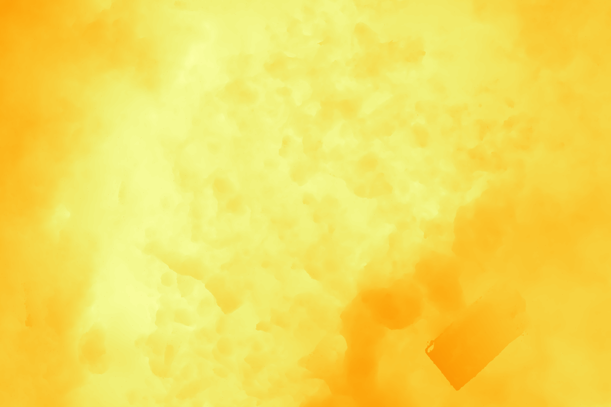
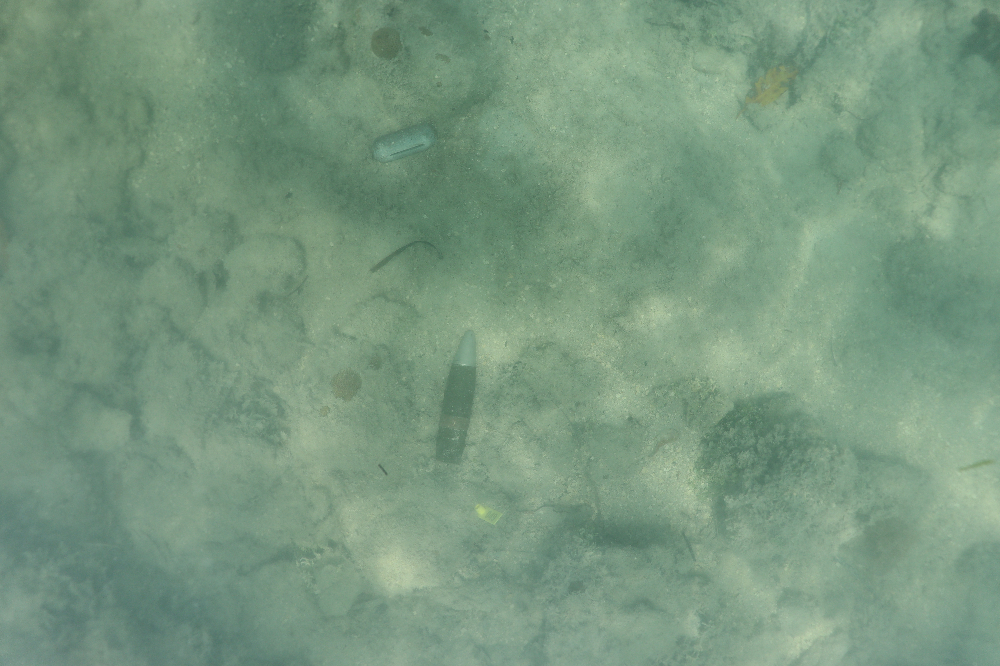
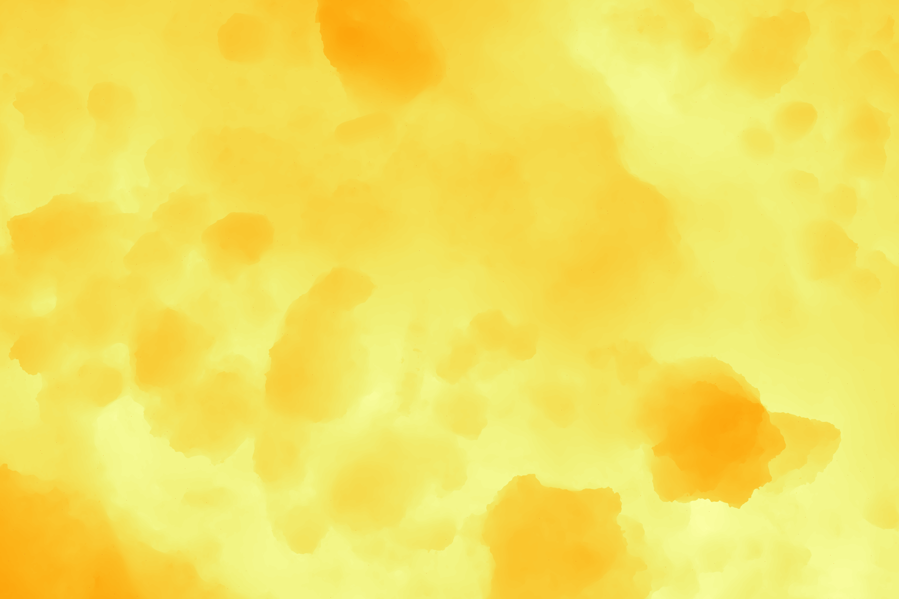
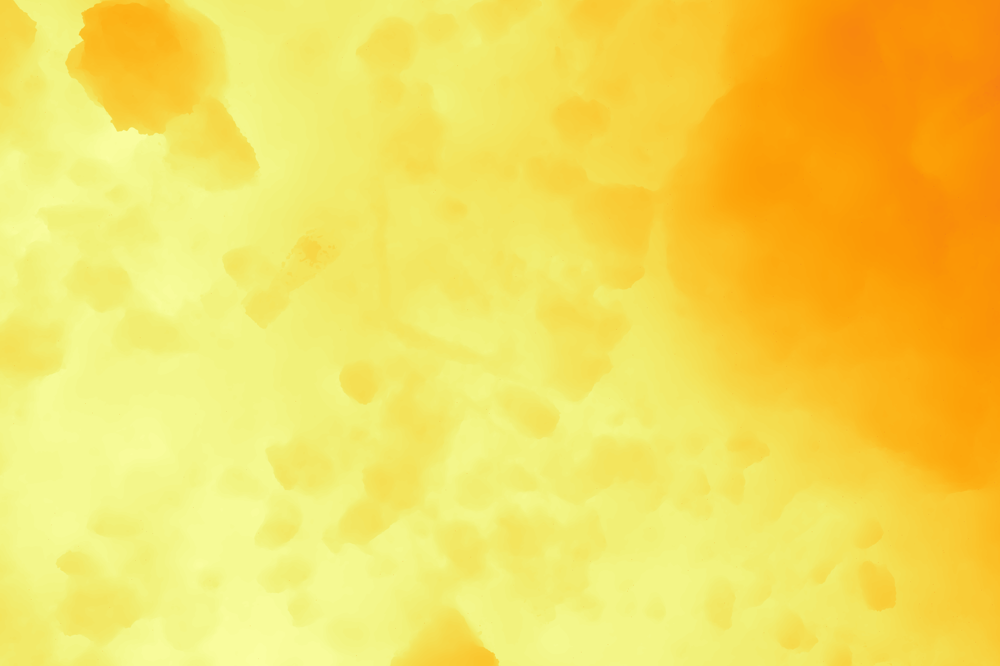
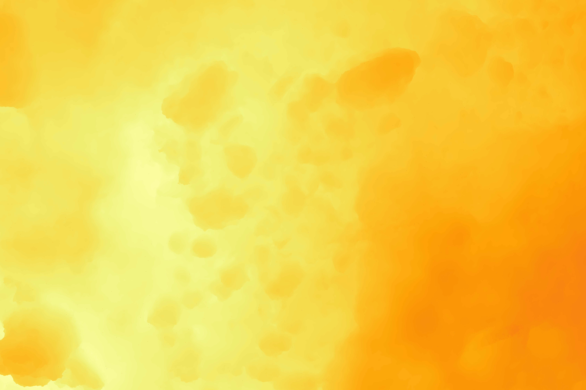

# MeshToDepth: Generate Depth Maps from 3D Meshes and Camera Poses

MeshToDepth is a Python tool designed to generate depth maps from a 3D mesh (`.obj`, `.ply`, `.stl`) using camera pose information. It simulates camera views based on provided calibration and transformation data, performs ray tracing against the mesh, and outputs depth images corresponding to each camera view.

## Features

* **Depth and Heat Maps Generation:** Creates 16-bit depth maps (in millimeters) from specified camera viewpoints by ray tracing against a 3D mesh. A value of zero is used to indicate an invalid value in the depth map. Corresponding heat maps are automatically generated to visualize the computed depth.
* **Optional Scene Rendering:** Can save rendered RGB images of the mesh from each camera view for visualization or debugging.
* **Multiple Camera Formats:** Currently supports camera calibration and pose files from Agisoft Metashape (`.xml`) and Meshroom (`.sfm`). Support for other software solutions can be added by extending the parsers available.
* **Mesh Scaling for True Distances:** Allows for dynamic rescaling of the depth data obtained by specifying a known distance between poses.
* **Camera Distortion Model Support:** The depth maps and scene images generated can be distorted using the distortion parameters of the given camera.
* **Perspective Correction:** Optionally aligns the output depth maps and rendered views to match the perspective of a real-world reference photograph using feature matching (SIFT) and image homography. Can be used to generate full-views with no null regions by increasing the field of view and then cropping the scene.
* **Manual View Generation:** Supports defining custom camera views for depth computation. Although camera intrinsics are specified by the user for manual view generation, a camera file is still needed for rescaling the mesh (if enabled).

**Note**: It is important to note that the quality of the scene captured and depth maps generated depends on the mesh quality used. If scene
generation is enabled, not only will computational time increase, but so will resource usage.

## Example Output

<table style="width:100%; text-align: center;">
  <tr>
    <th style="text-align: center;">Original Image</th>
    <th style="text-align: center;">Aligned Scene Image</th>
    <th style="text-align: center;">Aligned Depth Map</th>
  </tr>
  <tr>
    <td></td>
    <td></td>
    <td></td>
  </tr>
  <tr>
    <td></td>
    <td></td>
    <td></td>
  </tr>
  <tr>
    <td></td>
    <td></td>
    <td></td>
  </tr>
  <tr>
    <td></td>
    <td></td>
    <td></td>
  </tr>
  <tr>
    <td></td>
    <td></td>
    <td></td>
  </tr>
</table>
