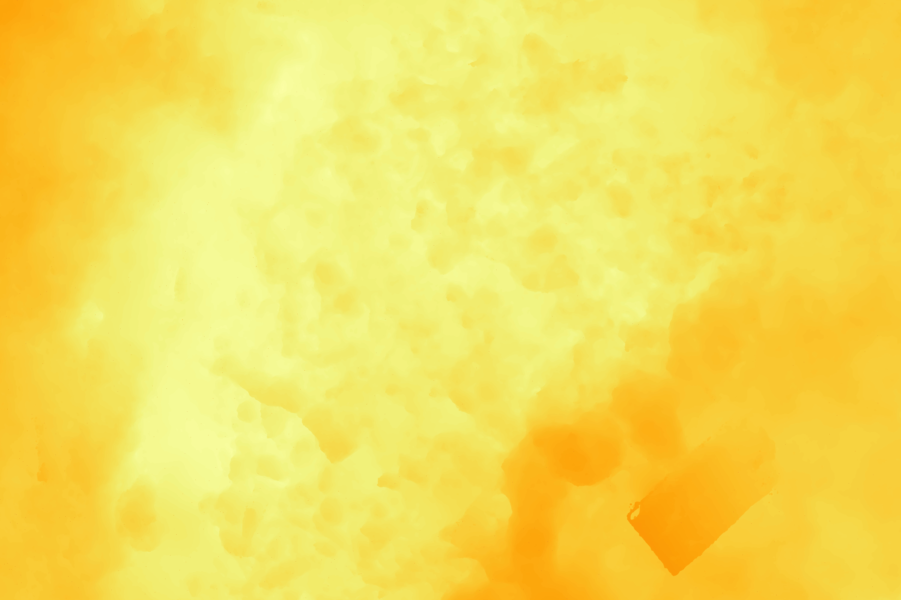

# MeshToDepth: Generate Depth Maps from 3D Meshes and Camera Poses

MeshToDepth is a Python tool designed to generate depth maps from a 3D mesh (`.obj`, `.ply`, `.stl`) using camera pose information. It simulates camera views based on provided calibration and transformation data, performs ray tracing against the mesh, and outputs depth images corresponding to each camera view. It also includes an optional feature for perspective correction using a reference image.

## Features

* **Depth Map Generation:** Creates 16-bit depth maps (in millimeters) from specified camera viewpoints by ray tracing against a 3D mesh. A value of zero is used to indicate an invalid value in the depth map.
* **Multiple Camera Formats:** Currently supports camera calibration and pose files from Agisoft Metashape (`.xml`). Support to Meshroom (`.sfm`) and Alembic (`.abc`) file formats will be added in the future.
* **Flexible Mesh Input:** Accepts common mesh formats (`.obj`, `.ply`, `.stl`) via the `trimesh` library.
* **Perspective Correction:** Optionally aligns the output depth maps and rendered views to match the perspective of a real-world reference photograph using feature matching (ORB) and image homography.
* **Optional Scene Rendering:** Can save rendered RGB images of the mesh from each camera view for visualization or debugging.

**Note**: It is important to note that the quality of the scene captured and depth maps generated depends on the mesh quality used. If scene
generation is enabled, not only will computational time increase, but so will resource usage.

## Example Output

<table style="width:100%; text-align: center;">
  <tr>
    <th style="text-align: center;">Original Image</th>
    <th style="text-align: center;">Aligned Scene Image</th>
    <th style="text-align: center;">Aligned Depth Map</th>
  </tr>
  <tr>
    <td></td>
    <td></td>
    <td></td>
  </tr>
</table>